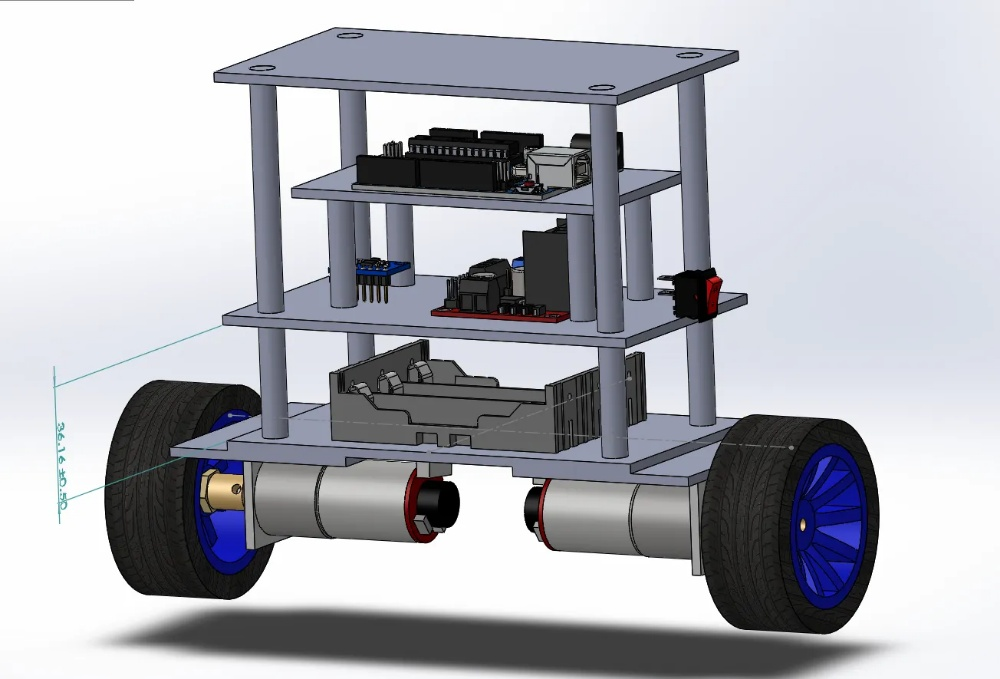

# Self-Balancing Robot (PID Control)
This project features a two-wheeled self-balancing robot.

## 🛠 Features
* **PID Control Loop:** Uses Proportional, Integral, and Derivative logic to maintain balance.
* **Fixed Timing:** The loop is locked to **10ms (100Hz)** for consistent sensor readings and motor response.
* **Safety Kill Switch:** Automatically shuts down motors and resets PID integral if the tilt exceeds **45 degrees** to prevent hardware damage.
* **Motor Deadband Fix:** Ensures the motors receive enough power to overcome gear friction at low speeds.
* **Watchdog Safety:** A 150ms communication heartbeat that auto-stabilizes the robot if the USB/Bluetooth signal is lost.

## 📸 Mechanical Design
The chassis is designed with a high center of gravity to optimize the PID response torque

## 🔌 Hardware Setup
* **Controller:** Arduino Uno
* **IMU:** MPU6050 (connected via I2C)
* **Motor Driver:** L298N H-Bridge
* **Motors:** 2x JGA25-371 DC Motors (12V)
* **Power:** 3x Li-ion 18650

## 🔌 Hardware Configuration & Pinout

| Component | Pin | Function |
| :--- | :--- | :--- |
| **MPU6050 SDA** | A4 | I2C Data |
| **MPU6050 SCL** | A5 | I2C Clock |
| **L298N ENA** | 5 | Left Motor PWM (Speed) |
| **L298N IN1 / IN2** | 6, 7 | Left Motor Direction Control |
| **L298N ENB** | 9 | Right Motor PWM (Speed) |
| **L298N IN3 / IN4** | 8, 10 | Right Motor Direction Control |
| **Status LED** | 13 | Calibration & Fall Alarm Indicator |

## 🚀 How to Run
1.  **Environment:** Open in VS Code with the PlatformIO extension.
2.  **Building:** Click the Checkmark to automatically download the `MPU6050_light` library.
3.  **Calibration:** Hold the robot perfectly level. The LED on Pin 13 will turn on once calibration is complete.
4g. **Tuning:** Use the Serial Plotter to visualize currentAngle vs pidOutput for fine-tuning $K_p$, $K_i$, and $K_d$.

## 🚀 Control Interface (Fil Pilote)
The robot is controlled via the **Serial Monitor** (9600 baud) over USB.
* **'w'**: Move Forward
* **'s'**: Move Backward
* **'a'**: Rotate Left
* **'d'**: Rotate Right
* **'Note:** Releasing the key triggers the 150ms watchdog to auto-calibrate.
